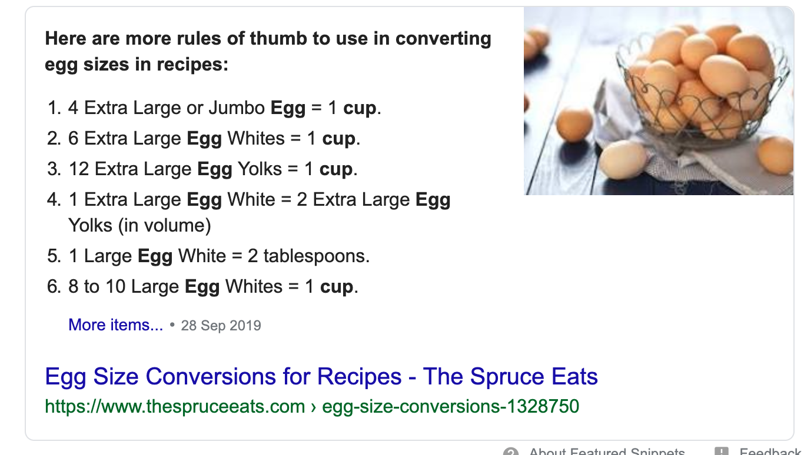

```{r setup, include=FALSE}
knitr::opts_chunk$set(echo = TRUE)
library(tidyverse)
library(here)
library(knitr)
```

The only assumption made during data cleaning was that "Sour cream cup" could be measured in terms of "one" units. This makes intuitive sense as the name suggests that it comes in pre-packaged cups, but the cups might not necessarily be exactly one cup measurement.

First: import clean data:

```{r message=FALSE}
cakes_clean <- read_csv(here::here("clean_data/cakes_clean.csv"))
```

## Question 1: Which cake has the most cocoa in it?

```{r}
most_cocoa <- cakes_clean %>%
  filter(ingredient == "Cocoa") %>%
  arrange(desc(amount)) %>%
  slice(1)

kable(most_cocoa)
```

## Question 2: For sponge cake, how many cups of ingredients are used in total?

Let's look at the ingredients:
```{r}
sponge_ingredients <- cakes_clean %>%
  select(cakes, measure, ingredient, amount) %>%
  filter(cakes == "Sponge")

kable(sponge_ingredients)
```

One teaspoon is 0.0208333 cups, but we'll have to make an estimate for Eggs. A quick Google search yields the following conversion:

<center>
 
</center>

So the conversion is 4 eggs to 1 cup, or 1 egg is 0.25 cups. All that's left to do is convert all ingredients to cups and sum:

```{r}
#pull out individual measurements:
sponge_teaspoons <- sponge_ingredients %>%
  filter(measure == "teaspoon")

#could hard-code eggs, but will try to keep the code flexible:
sponge_eggs <- sponge_ingredients %>%
  filter(ingredient == "Eggs")

sponge_cups <- sponge_ingredients %>%
  filter(measure == "cup")

#convert and sum it all up:

kable(round(((sum(sponge_teaspoons$amount)) * 0.0208333) + 
  (sum(sponge_eggs$amount) * 0.25) +
  (sum(sponge_cups$amount)), digits = 2))
```

So there are 4.54 cups of ingredients in a sponge cake. 

## Question 3: How many ingredients are measured in teaspoons?

```{r}
#pull out teaspoons, count unique items:

teaspoons <- cakes_clean %>%
  filter(measure == "teaspoon")

kable(count(teaspoons))
```

45 different ingredients are measured in teaspoons.

## Question 4: Which cake has the most unique ingredients?

```{r}
#group by cake, summarise by unique ingredient count:

unique_ingredients <- cakes_clean %>%
  group_by(cakes) %>%
  summarise("unique_ingredients" = n_distinct(ingredient)) %>%
  arrange(desc(unique_ingredients)) %>%
  slice(1:3)

kable(unique_ingredients)
```

Babas au Rhum	and One Bowl Chocolate cakes are tied with 11 unique ingredients apiece.


## Question 5: Which ingredients are used only once?

```{r}

ingredients_once <- cakes_clean %>%
  #group by ingredients
  group_by(ingredient) %>%
  #count number of times each ingredient appears
  count(ingredient) %>%
  rename("times_used" = "n") %>%
  #filter to only ingredients used once
  filter(times_used == 1)

kable(ingredients_once)
```

