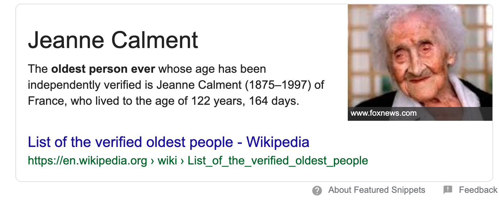

```{r setup, include=FALSE}
knitr::opts_chunk$set(echo = TRUE)
library(tidyverse)
library(here)
library(knitr)
```

Assumptions made during data cleaning:  

* That the 2017 question "Q1 Going Out" is the same as the previous years' questions about whether or not the individual is going trick-or-treating
* That NA's in the ratings could be dropped. I considered imputing them to "Meh," but I do not think that would be appropriate as it would artificially inflate the number of "Meh" responses.
* That the country "Korea" could be imputed to "South Korea," as it is unlikely (though not impossible) that citizens of North Korea would have been able to complete the survey.
* All NA values for the ages of trick-or-treaters have been removed. Another option would have been to impute them to the mean value, but this would artificially skew the average results towards the mean.
* The ages of trick-or-treaters has been capped at 122, as the oldest living person ever independently verified lived to be 122 per the google search below.
* NOTE TO SELF: COME BACK TO THE AGES. It would be better to impute all NA's and invalid entries to average age - what if all the NA ages put "yes"?

<center>
 
</center>

First things first: load in all data

```{r, message = FALSE}
candy_cleaned <- read_csv(here::here("clean_data/candy_cleaned.csv"))
going_total <- read_csv(here::here("clean_data/going_total.csv"))
```


### Question 1: What is the total number of candy ratings given across the three years. (number of candy ratings, not number of raters. Don’t count missing values)

Answer: NA's have already been removed and our tibble is in long-form based on ratings, so we can just count the number of items. The total number of candy ratings given across the three years is `r count(candy_cleaned)`

### Question 2: What was the average age of people who are going out trick or treating and the average age of people not going trick or treating?

```{r}
#just need to sort by going or not going and take the mean age
going <- going_total %>%
  filter(going == "Yes")

not_going <- going_total %>%
  filter(going == "No")
```

The average age of people who are going out trick or treating is `r round(mean(going$age), digits = 2)` years old, and the average age of people who are not going out trick or treating is `r round(mean(not_going$age), digits = 2)` years old.

